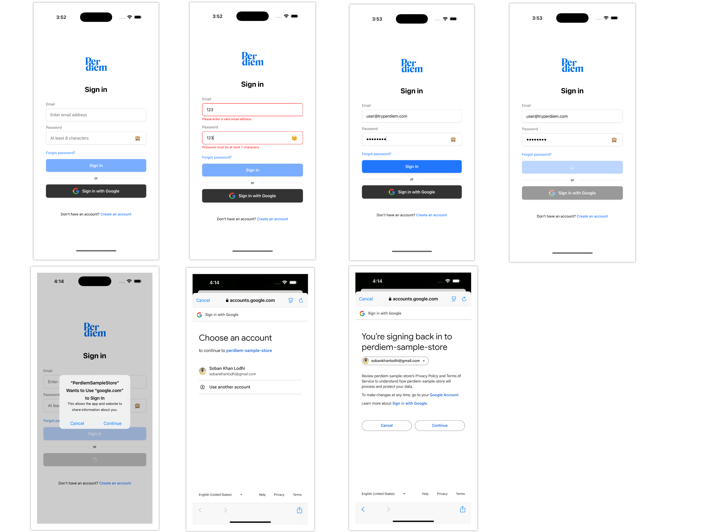
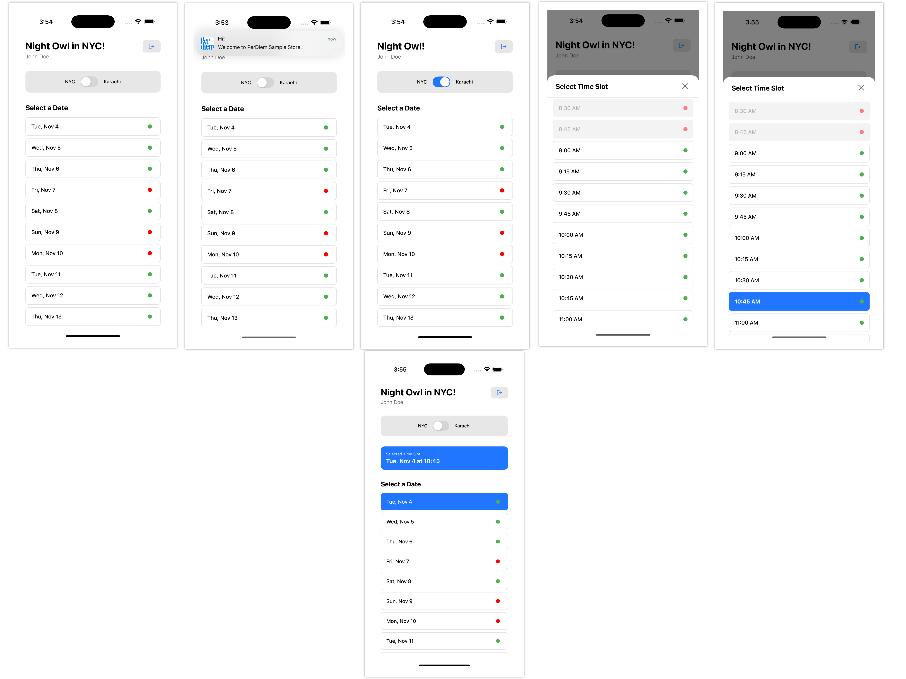

# Per Diem - React Native Sample Store App

A fully-featured React Native (CLI) application for managing store appointments with timezone-aware greetings, date/time slot selection, and push notifications.

## 📋 Overview

Per Diem is a React Native application built with TypeScript that provides:

- **Authentication**: Email/password login via mock API and Google Sign-In via Firebase
- **Home Screen**: NYC timezone-aware greetings, date list, time slot picker
- **Store Status**: Real-time availability checking with API integration
- **Push Notifications**: Local notifications for store opening reminders
- **Offline Support**: Caching with graceful offline mode handling
- **State Management**: Context API for global state
- **Secure Storage**: MMKV for token and data persistence

## ✨ Features

### Authentication

- Email/password authentication using mock API endpoint
- Google Sign-In integration with Firebase Authentication
- Secure token storage with MMKV
- Auto-verification of stored tokens on app launch
- Logout functionality with cleanup

### Home Screen

- **Timezone-Aware Greetings**: Dynamic greetings based on NYC time or local timezone
    - 5:00-9:59 AM → "Good Morning, NYC!"
    - 10:00-11:59 AM → "Late Morning Vibes, NYC!"
    - 12:00-4:59 PM → "Good Afternoon, NYC!"
    - 5:00-8:59 PM → "Good Evening, NYC!"
    - 9:00 PM-4:59 AM → "Night Owl in NYC!"
- **Timezone Toggle**: Switch between NYC and local timezone with persistence
- **Date List**: Next 30 days starting from today
- **Time Slot Picker**: 15-minute interval slots with store status indicators
- **Store Status**: Green (open) / Red (closed) indicators based on API data

### Push Notifications

- Local notifications scheduled 1 hour before next store opening
- Uses NYC timezone for calculation
- Works even when app is closed

### Offline Support

- Caches store times and overrides locally
- Graceful degradation with offline banner
- Automatic revalidation when connection is restored

## 🏗️ Architecture

```
src/
├── api/              # API clients
│   ├── auth.ts       # Authentication API
│   └── storeApi.ts   # Store times and overrides API
├── components/        # Reusable UI components
│   ├── Button.tsx
│   ├── CustomTextInput.tsx
│   ├── EyeIcon.tsx
│   ├── GoogleIcon.tsx
│   ├── Logo.tsx
│   ├── OfflineBanner.tsx
│   ├── Separator.tsx
│   ├── TimeSlotPicker.tsx
│   └── Toast.tsx
├── context/           # Context providers
│   └── AuthContext.tsx
├── hooks/             # Custom hooks
│   └── useNetworkStatus.ts
├── navigation/        # Navigation setup
│   └── AppNavigator.tsx
├── screens/           # Screen components
│   ├── HomeScreen.tsx
│   └── SignInScreen.tsx
├── utils/             # Utility functions
│   ├── constants.ts
│   ├── notifications.ts
│   ├── storage.ts
│   ├── timeUtils.ts
│   └── validation.ts
└── __tests__/         # Unit tests
    ├── authContext.test.tsx
    ├── storeApi.test.ts
    └── timeUtils.test.ts
```

### State Management

- **Context API**: Global authentication state
- **Local State**: Component-level state with React hooks
- **Persistent Storage**: MMKV for secure, fast key-value storage

### Data Flow

1. User authenticates → Token stored in MMKV
2. App verifies token on launch → Auto-login if valid
3. Home screen loads store data → Cached locally
4. User selects date/time → Validated against API
5. Notifications scheduled → Based on store opening times

## 🚀 Setup Instructions

### Prerequisites

- Node.js >= 20
- React Native CLI
- Xcode (for iOS)
- Android Studio (for Android)

### Installation

1. **Clone and install dependencies:**

   ```bash
   npm install
   ```
1. **iOS - Install CocoaPods:**

   ```bash
   cd ios
   bundle install
   bundle exec pod install
   cd ..
   ```
1. **Environment Configuration:**

   Create a `.env` file in the root directory:

   ```
   WEB_CLIENT_ID=your-google-web-client-id
   ```
1. **Firebase Setup:**

   - Ensure `google-services.json` (Android) and `GoogleService-Info.plist` (iOS) are configured
   - Configure Firebase Authentication with Google Sign-In enabled

### Running the App

#### Start Metro Bundler

```bash
npm start
```

#### Run on iOS

```bash
npm run ios
```

#### Run on Android

```bash
npm run android
```

## 🧪 Testing

### Run Unit Tests

```bash
npm test
```

### Test Coverage

- `timeUtils.test.ts` - Time utility functions
- `storeApi.test.ts` - Store API logic
- `authContext.test.tsx` - Authentication context

## 📱 API Integration

### Authentication Endpoint

- **POST** `/auth/`
    - Basic Auth: `perdiem/perdiem`
    - Body: `{ "email": string, "password": string }`
    - Response: `{ "token": string, "email": string }`

### Token Verification

- **GET** `/auth/verify`
    - Authorization: `Bearer <token>`

### Store Times

- **GET** `/store-times/`
    - Returns weekly schedule with opening/closing hours

### Store Overrides

- **GET** `/store-overrides/`
    - Returns holiday/exception overrides array

## 🔧 Configuration

### Base API URL

Configured in `src/api/auth.ts` and `src/api/storeApi.ts`:

```typescript
const API_BASE_URL = 'https://coding-challenge-pd-1a25b1a14f34.herokuapp.com';
```

### Timezone Preferences

Stored in MMKV with key `timezone_preference`:

- `'nyc'` - New York timezone (default)
- `'local'` - Device local timezone

## 📦 Key Dependencies

- `react-native`: Core framework
- `@react-navigation/native`: Navigation
- `@react-native-firebase/auth`: Firebase Authentication
- `@react-native-google-signin/google-signin`: Google Sign-In
- `react-native-mmkv`: Fast, secure storage
- `@notifee/react-native`: Local notifications
- `@react-native-community/netinfo`: Network status detection

## 🎨 Design System

### Colors

- Primary: `#2176FF`
- Black: `#000000`
- White: `#FFFFFF`
- Gray: `#666666`
- Error: `#FF0000`
- Dark Gray: `#333333`

### Spacing

- xs: 4px
- sm: 8px
- md: 16px
- lg: 24px
- xl: 32px

## 🐛 Error Handling

- Network errors gracefully handled
- Offline mode with cached data fallback
- User-friendly error messages
- Toast notifications for success/error states

## 📝 Assumptions

1. **API Response Format**: 

   - Authentication returns `token` field
   - Store times follow day-of-week structure (0-6)
   - Overrides are optional (404 is valid for no override)
1. **Timezone Handling**:

   - NYC timezone is `America/New_York`
   - Store hours are calculated in NYC timezone
   - Notifications scheduled in device local time but calculated from NYC
1. **Notifications**:

   - Scheduled 1 hour before opening
   - Canceled on logout
   - Re-scheduled when store times change
1. **Offline Behavior**:

   - Cached data used when offline
   - Banner displayed to inform user
1. **Password Validation**:

   - Minimum 7 characters (as perdiem credentials)
   - Placeholder shows "At least 8 characters" 

## 👥 Contributors

Built as a sample implementation for Per Diem.

---

## Sample Screenshots 

### Login Journey



### Home Screen Journey



**[View more screenshots →](./screenshot-samples.md)**

